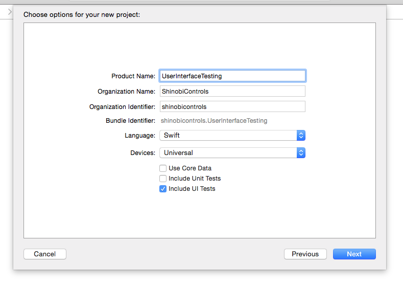
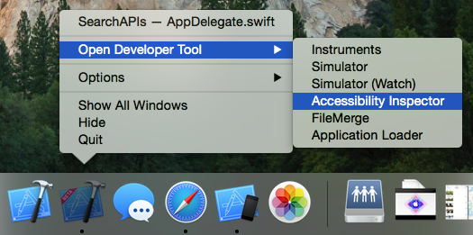

#iOS9 Day by Day
# 2. User Interface Testing

Automated User Interface Testing is a valuable tool when developing any software application. It can detect problems with your app quickly, and a successful test suite run can provide you with confidence before a release. On the iOS platform, this is currently done using UIAutomation, with tests written in JavaScript. This involves opening up a separate app, Instruments, and creating and running scripts. The workflow is painfully slow and takes a long time to get used to. 

##UI Testing
With Xcode 7, Apple have introduced a new way to conduct user interface testing on your apps. UI testing allows you to find and interact with UI elements, and validate their properties and state. UI testing is fully integrated with Xcode 7 test reports, and will run alongside your unit tests. XCTest has been Xcode's integrated testing framework since Xcode 5, but in Xcode 7, it has been updated to include new UI testing abilities. This allows you to make assertions which  check the state of your UI at a certain point.

###Accessibility
In order for UI Testing to work, the framework needs to be able to access the various elements inside the UI so it can carry out it's actions. You could define specific points where the tests should tap and swipe, but this would fall down on different sized devices, or if you made tweaks to the positions of the elements in your UI.

This is where accessibility can help. Accessibility is a long established Apple framework that provides disabled users with a way to interact with your applications. It provides rich semantic data about your UI which allow the various Accessibility features to open your app up to disabled users. A lot of this functionality comes out of the box and will just work with your app, but you can (and should) improve the data that Accessibility has about your UI using the Accessibility APIs. There are many cases where this is necessary, for example custom controls where Accessibility won't be able to figure out what your API does automatically. 

UI Testing has the ability to interface with your app through the Accessibility features that your app provides, which gives you a great solution to the different sized device problem, and provides you from having to rewrite your entire test suite if you rearrange some elements in your UI. Not only does it help with UI Testing, implementing Accessibility also gives you the added benefit of making your app available to disabled users.

###UI Recording
Once you have set up your accessible UI, you'll want to create some UI tests. Writing UI tests can be time consuming, boring, and if you have a complicated UI, difficult! Thankfully in Xcode 7, Apple have introduced UI Recording, which allows you to create new, and expand existing tests. When turned on, code will automatically be generated when you interact with your app on the device or the simulator. Now that we have a good overview of how UI Testing fits together, it's time to have a go at using it!

##Creating UI Tests
We're going to build a UI Testing suite using the new UI Testing tools to demonstrate how this works. The finished demo application is available at [GitHub](TODO) if you wish to follow along and see the result.

### Setup
In Xcode 7, when you create a new project, you can choose whether to include UI Tests. This will set up a placeholder UI Test target for you with all of the configuration you need.

### Using UI Recording

#### When Recording Goes Wrong
Sometimes when you tap on an element while recording, you'll notice that the code produced doesn't look quite right. This is usually because the element you are interacting with is not visible to Accessibility. To find out if this is the case, you can use XCode's Accessibility Inspector.

Once it is open, if you hit CMD+F7 and hover over an element with your mouse in the simulator, then you'll see comprehensive information about the element underneath the cursor. This should give you a clue about why Accessibility can't find your element.

Once you've identified the issue, open up interface builder and in the identity inspector you'll find the Accessibility panel. This allows you to enable Accessibility, and set hints, labels identifiers, and traits. These are all powerful tools to enable Accessibility to access your interface.

### The XCTest UI Testing API

As you can see from the code generated by the recording above, XCTest has been expanded to include three new pieces of API.

- **XCUIApplication**. This is a proxy for the application you are testing. It allows you to launch your application so that you can run tests on it. It's worth noting that it always launches a new process. This takes a little more time, but it means that the slate is always clean when it comes to testing your app and there are fewer variables that you have to deal with.

- **XCUIElement**. This is a proxy for the UI elements for the application you are testing. Elements all have types and identifiers, which you can combine to allow you to find the elements in the application. The elements are all nested in a tree which represents your application.

- **XCUIElementQuery**. When you want to find elements, you use element queries. Every `XCUIElement` is backed by a query. Such queries search the XCUIElement tree and **must** resolve to exactly one match. Otherwise your test will fail when you try to access the element. The exception to this is the `exists` property, where you can check if an element is present in the tree. This is useful for assertions. You can use `XCUIElementQuery` more generally, when you want to find elements that are visible to accessibility. Queries return a set of results.
