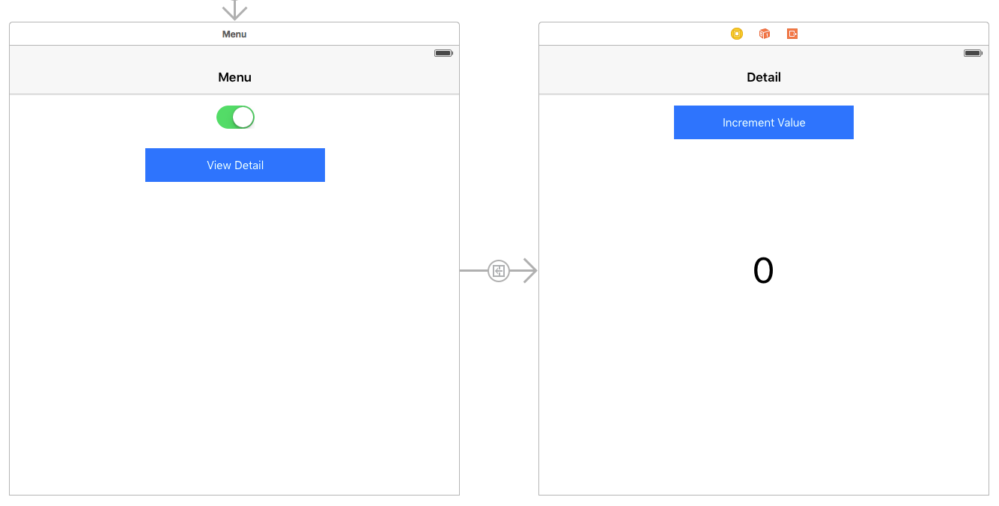
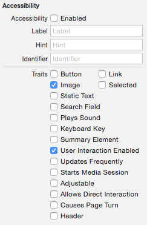
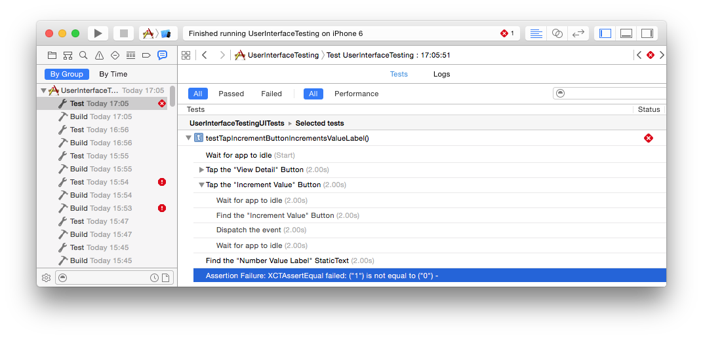

#iOS 9 Day by Day
# 2. User Interface Testing

Automated User Interface Testing is a valuable tool when developing any software application. It can detect problems with your app quickly, and a successful test suite run can provide you with confidence before a release. On the iOS platform, this is currently done using UIAutomation, with tests written in JavaScript. This involves opening up a separate app, Instruments, and creating and running scripts. The workflow is painfully slow and takes a long time to get used to. 

##UI Testing
With Xcode 7, Apple have introduced a new way to conduct user interface testing on your apps. UI testing allows you to find and interact with UI elements, and validate their properties and state. UI testing is fully integrated with Xcode 7 test reports, and will run alongside your unit tests. XCTest has been Xcode's integrated testing framework since Xcode 5, but in Xcode 7, it has been updated to include new UI testing abilities. This allows you to make assertions which will check the state of your UI at a certain point.

###Accessibility
In order for UI Testing to work, the framework needs to be able to access the various elements inside the UI so it can carry out it's actions. You could define specific points where the tests should tap and swipe, but this would fall down on different sized devices, or if you made tweaks to the positions of the elements in your UI.

This is where accessibility can help. Accessibility is a long established Apple framework that provides disabled users with a way to interact with your applications. It provides rich semantic data about your UI which allow the various Accessibility features to open your app up to disabled users. A lot of this functionality comes out of the box and will just work with your app, but you can (and should) improve the data that Accessibility has about your UI using the Accessibility APIs. There are many cases where this is necessary, for example custom controls where Accessibility won't be able to figure out what your API does automatically. 

UI Testing has the ability to interface with your app through the Accessibility features that your app provides, which gives you a great solution to the different sized device problem, and provides you from having to rewrite your entire test suite if you rearrange some elements in your UI. Not only does it help with UI Testing, implementing Accessibility also gives you the added benefit of making your app available to disabled users.

###UI Recording
Once you have set up your accessible UI, you'll want to create some UI tests. Writing UI tests can be time consuming, boring, and if you have a complicated UI, difficult! Thankfully in Xcode 7, Apple have introduced UI Recording, which allows you to create new, and expand existing tests. When turned on, code will automatically be generated when you interact with your app on the device or the simulator. Now that we have a good overview of how UI Testing fits together, it is time to start using it!

##Creating UI Tests
We're going to build a UI Testing suite using the new UI Testing tools to demonstrate how this works. The finished demo application is [available at GitHub](https://github.com/shinobicontrols/iOS9-day-by-day/tree/master/02-User-Interface-Testing) if you wish to follow along and see the result.

### Setup
In Xcode 7, when you create a new project, you can choose whether to include UI Tests. This will set up a placeholder UI Test target for you with all of the configuration you need.

The project set up in this example is very simple but should be enough for us to demonstrate how the UI Testing works in Xcode 7. 

There is a menu view controller that contains a switch and a button that links you to a detail view controller. When the switch is in the "off" state, the button should be disabled and navigation should not be possible. The detail view controller contains a simple button which increments the value in a label.

### Using UI Recording
Once the UI has been set up and is functional, we can write some UI tests to ensure that any changes in the code do not effect functionality. 

#### The XCTest UI Testing API

Before we start recording actions we must decide what we want to assert. In order to assert certain things about our UI, we can use the XCTest Framework, which has been expanded to include three new pieces of API.

- **XCUIApplication**. This is a proxy for the application you are testing. It allows you to launch your application so that you can run tests on it. It's worth noting that it always launches a new process. This takes a little more time, but it means that the slate is always clean when it comes to testing your app and there are fewer variables that you have to deal with.

- **XCUIElement**. This is a proxy for the UI elements for the application you are testing. Elements all have types and identifiers, which you can combine to allow you to find the elements in the application. The elements are all nested in a tree which represents your application.

- **XCUIElementQuery**. When you want to find elements, you use element queries. Every `XCUIElement` is backed by a query. Such queries search the XCUIElement tree and **must** resolve to exactly one match. Otherwise your test will fail when you try to access the element. The exception to this is the `exists` property, where you can check if an element is present in the tree. This is useful for assertions. You can use `XCUIElementQuery` more generally, when you want to find elements that are visible to accessibility. Queries return a set of results.

Now that we have a way to explore the API we are ready to start writing some tests.

####Test 1 - Ensuring no navigation takes place when the switch is off
First of all we must define a function that will contain our test.

    func testTapViewDetailWhenSwitchIsOffDoesNothing() {
    
    }
    
When the function has been defined, we move the mouse cursor inside of its brackets and tap the record button at the bottom of the Xcode window.

The app will now launch. Tap the switch to turn it off, then tap the "View Detail" button. The following should now appear inside `testTapViewDetailWhenSwitchIsOffDoesNothing`.

		let app = XCUIApplication()
		app.switches["View Detail Enabled Switch"].tap()
		app.buttons["View Detail"].tap()

Now click the record button again and the recording should stop. We can see that the app didn't actually display the detail view controller, but the test has no way of knowing that currently. We must assert that nothing has changed. We can do this by inspecting the title of the navigation bar. This might not be appropriate for all use cases, but it works for us here.

		XCTAssertEqual(app.navigationBars.element.identifier, "Menu")

Once you've added this line, run the test again and it should still pass. Try changing the "Menu" string to "Detail" for example, and it should fail. Here's the final result of this test with some comments added to explain the behaviour:

	func testTapViewDetailWhenSwitchIsOffDoesNothing() {
		let app = XCUIApplication()
    
		// Change the switch to off.
		app.switches["View Detail Enabled Switch"].tap()
    
		// Tap the view detail button.
		app.buttons["View Detail"].tap()
    
		// Verify that nothing has happened and we are still at the menu screen.
		XCTAssertEqual(app.navigationBars.element.identifier, "Menu")
	}

####Test 2 - Ensuring navigation takes place when the switch is on
The second test is similar to the first, so we won't go through it in detail. The only difference here is that the switch is enabled, so the app should load the detail screen, and the XCTAssertEqual verifies this.

	func testTapViewDetailWhenSwitchIsOnNavigatesToDetailViewController() {
		let app = XCUIApplication()
        
		// Tap the view detail button.
		app.buttons["View Detail"].tap()
        
		// Verify that navigation occurred and we are at the detail screen.
		XCTAssertEqual(app.navigationBars.element.identifier, "Detail")
	}

####Test 3 - Ensuring the increment button increments the value label.
In this test we verify that when a user clicks the increment button, the value label increases by 1. The first two lines of this test are very similar, so we can copy and paste them from the previous test.

		let app = XCUIApplication()
		
		// Tap the view detail button to open the detail page.
		app.buttons["View Detail"].tap()

Next we need to gain access to the button. We will want to tap this a few times so we will store it as a variable. Rather than manually typing the code to find the button and having to debug it, launch the recorder again and click the button. This will give you the following code.

	app.buttons["Increment Value"].tap()
	
We can then stop the recorder and change this to

	let incrementButton = app.buttons["Increment Value"]
	
This way we don't need to manually type out the code to find the button. We do the same for the value label.

	let valueLabel = app.staticTexts["Number Value Label"]
	
Now we have the UI elements we are interested in we can interact with them. In this test we will verify that after tapping on the button 10 times, the label is updated accordingly. We could record this 10 times in the recorder, but because we stored the elements above, we can simply put it in a for loop.

	for index in 0...10 {
		// Tap the increment value button.
		incrementButton.tap()

		// Ensure that the value has increased by 1.
		XCTAssertEqual(valueLabel.value as! String, "\(index+1)")
	} 

These three tests are far from a comprehensive test suite, but they should give you a good starting point and you should be able to expand upon them easily. Why not try adding a test yourself that verifies that the button is enabled and you can navigate if you turn the switch off and then back on again?

#### When Recording Goes Wrong
Sometimes when you tap on an element while recording, you'll notice that the code produced doesn't look quite right. This is usually because the element you are interacting with is not visible to Accessibility. To find out if this is the case, you can use XCode's Accessibility Inspector.

Once it is open, if you hit CMD+F7 and hover over an element with your mouse in the simulator, then you'll see comprehensive information about the element underneath the cursor. This should give you a clue about why Accessibility can't find your element.

Once you've identified the issue, open up interface builder and in the identity inspector you'll find the Accessibility panel. This allows you to enable Accessibility, and set hints, labels identifiers, and traits. These are all powerful tools to enable Accessibility to access your interface.

#### When a Test Fails
If a test fails and you aren't sure why, there's a couple of ways to help you fix it. First of all, you can access the test reports in Xcode's Report Navigator. 

When you open this view and hover over certain steps in the tests, you will see a small eye icon to the right of the test action. If you click this eye, you are presented with a screenshot of the state of your app at that exact point. This will let you visually check the state of your UI and find out exactly what is wrong.

Just like unit tests, you can add breakpoints to UI tests, which allows you to debug the behaviour and find any problems. You can log the view hierarchy and inspect accessibility properties using this technique to see why your test is failing.

##Why you should use UI Testing
Automated UI Testing is a great way to improve quality assurance while giving you the confidence to make changes to your app. We have seen how simple it is to get UI Testing up and running in Xcode, and how adding Accessibility features to your app cannot only help you test your app, but also has the added benefit of helping users with disabilities to use your app.

One of the best new features of UI Testing in Xcode is the ability to run your tests from your continuous integration server. There's support for doing so with Xcode bots, and also [from the command line](https://krausefx.com/blog/run-xcode-7-ui-tests-from-the-command-line) meaning when a UI Test fails you can be immediately informed!

##Further Reading
For more information on the new UI Testing features in XCode, I'd recommend watching WWDC session 406, [UI Testing in Xcode](https://developer.apple.com/videos/wwdc/2015/?id=406). You may also be interesting in reading the [Testing in Xcode Documentation](https://developer.apple.com/library/prerelease/ios/documentation/DeveloperTools/Conceptual/testing_with_xcode/chapters/Introduction.html#//apple_ref/doc/uid/TP40014132), and the [Accessibility for Developers Documentation](https://developer.apple.com/accessibility/)