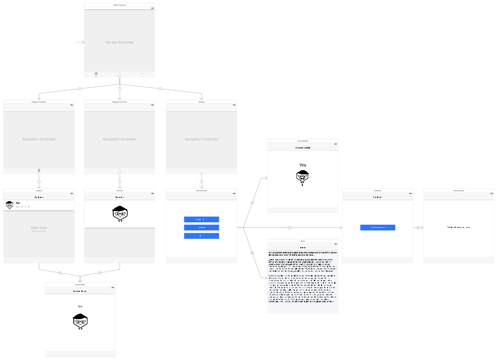

#iOS 9 Day by Day
#3. Storyboard References
If you've used interface builder to build a complicated application with a lot of screens before, you'll know how large Storyboards can become. This quickly becomes unmanageable and slows you down. Since the introduction of Storyboards, it's been possible to split different regions of your app into separate Storyboards. In the past, this involved manually creating separate Storyboard files and a considerable amount of code. 

In order to resolve this, in iOS 9 Apple have introduced the concept of Storyboard References. Storyboard References allow you to reference view controllers in other storyboards from your segues. This means that you can keep each region of your app modular, and your Storyboards become smaller and more manageable. Not only is this easier to understand, but when working in a development team it will make merges simpler.

##Simplifying A Storyboard
In order to demonstrate how Storyboard References work, lets take an existing application and try to simplify its structure. The application in question is available over at [GitHub](https://github.com/shinobicontrols/iOS9-day-by-day/tree/master/03-Storyboard-References) if you wish to follow along and then see the final result. The `OldMain.Storyboard` file is what we start with, and is included in the project for reference only. It isn't actually used any more. If you want to follow along, delete all of the storyboards in the project and rename `OldMain.Storyboard` to `Main.Storyboard`.

The screenshot below is how the original Storyboard looks.

As you can see, we are using a Tab Bar Controller as the initial view controller. This Tab Bar Controller has 3 navigation controllers, all with different root view controllers. The first one is table view controller with a list of contacts, the second is another table view controller with a list of favourite contacts. Both of these link to the same contact detail view controller. The third navigation controller contains more information about the application including account details, a feedback screen and an about screen.

Although this application is far from complicated, the Storyboard is already fairly large. I've seen Storyboards in the past with well over 10 times the number of view controllers in them, and as we all know, this quickly becomes unmanageable. Now though, we can split them up. So where should we start? In this case, we have three distinct regions. We can clearly identify these as they are the content for each section of the tab bar controller. 

We will start with the simplest case. On the right hand side of Main.storyboard you should see the view controllers that provide more information about our application. These view controllers are self contained and don't link to any common views that anything other view controllers in the application link to.

All we have to do is select these view controllers by dragging and highlighting them all. Once we have done that, select "Editor", then "Refactor to Storyboard" from Xcode's menu bar.

Give the storyboard a name of `More.storyboard` then click save. `More.storyboard` will be added to your application and opened for you.

You can see that the storyboard has been created. If you now return to `Main.storyboard`, you will see that one of the tab bar controller's view controller has changed to a Storyboard Reference.

